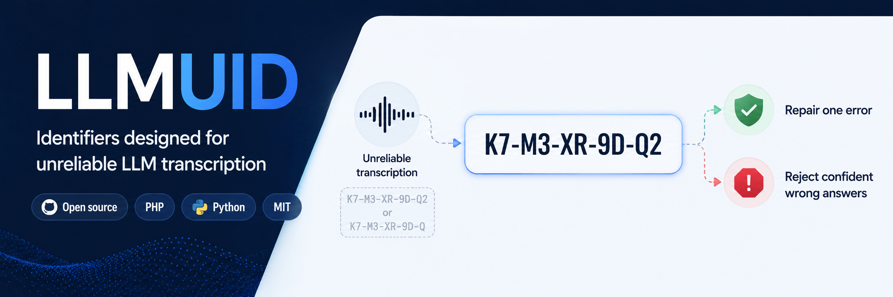

# LLMUID

> Identifiers that resist hallucination, survive repeated LLM copying, and
> repair themselves when damaged — or fail honestly when they can't.

LLMUID is an identifier scheme for systems where identifiers must pass through
large language models — read, copied and re-emitted across many prompt hops.
LLMs are an unreliable transcription channel with failure modes unlike any
traditional transport, and no conventional identifier scheme is designed for
them.

```
K7-M3-XR-9D-Q2
```

Ten symbols over a 29-symbol alphabet of digits and consonants, eight of them a
random payload and two of them check symbols, written as five groups of two.
No vowels, so an identifier can never spell a word. No lookalikes, so it can
never be misread across ambiguous glyphs.

The contract is one line: **any single damage event is silently repaired, and
anything more is a failure.** Fabricated identifiers are detectable, common
damage is repairable, and everything else fails loudly instead of misrouting
silently.

**[See it work →](https://philippelyp.github.io/llmuid/)** — an interactive
companion to the specification. It animates the damage model, and every verdict
on it comes from a real implementation running in your browser, graded against
the conformance vectors below before the first demo is wired up.

## This repository

This is the specification, and it is authoritative. The implementations follow
it without variation; where an implementation and this document disagree, the
implementation is wrong.

- **[llmuid.md](llmuid.md)** — the design specification: what the scheme
  guarantees and why, independent of any language.
- **[vectors/](vectors/)** — the conformance vectors every implementation is
  graded against. Frozen; see [vectors/README.md](vectors/README.md).
- **[interactive/](interactive/)** — the article above, exactly as it is
  served. It is the one place this repository carries code, and it carries it
  as a copy rather than as a second implementation:
  [interactive/llmuid.js](interactive/llmuid.js) is
  [llmuid-javascript](https://github.com/philippelyp/llmuid-javascript) v1.0.0
  byte for byte, and `interactive.js` beside it is the page's own wiring, which
  drives that class through its public API like any other consumer. The
  specification itself defines no code and depends on none.

## Implementations

| Language | Repository | Package | Install |
|---|---|---|---|
| PHP | [llmuid-php](https://github.com/philippelyp/llmuid-php) | Packagist `philippelyp/llmuid` | `composer require philippelyp/llmuid` |
| Python | [llmuid-python](https://github.com/philippelyp/llmuid-python) | PyPI `llmuid` | `pip install llmuid` |
| JavaScript | [llmuid-javascript](https://github.com/philippelyp/llmuid-javascript) | npm `llmuid` | `npm install llmuid` |

## What conformance means

An implementation conforms when it passes every case in [vectors/](vectors/).
That bar exists because the failure it prevents is silent: two implementations
that derive the context digest differently both mint perfectly well-formed
identifiers, and neither can resolve the other's. Nothing crashes and nothing
logs.

Writing a new implementation means reading [llmuid.md](llmuid.md) and passing
[vectors/](vectors/) — not reading an existing implementation's source. The
vectors are the reference; the code is one rendering of it.

All three implementations carry a copy of [vectors/](vectors/) inside the
package and grade themselves against all 134 cases at runtime, through
`self_test()` — the answer key ships with every install, and conformance is one
method call away. The canonical set is this one; the copies follow it. So does
[the article](https://philippelyp.github.io/llmuid/), which grades itself in
front of you rather than claiming a badge.

## Not a security mechanism

The random payload makes identifiers statistically unguessable, but not
cryptographically so, and the check symbols are public arithmetic anyone can
compute. **Identifiers must never be used as secrets, capabilities or bearer
tokens**, and possession of a valid identifier must never grant authority. The
adversary in this design is a hallucinating model, not an attacker;
authentication and authorization belong to other layers.

## License

MIT — see [LICENSE](LICENSE).
